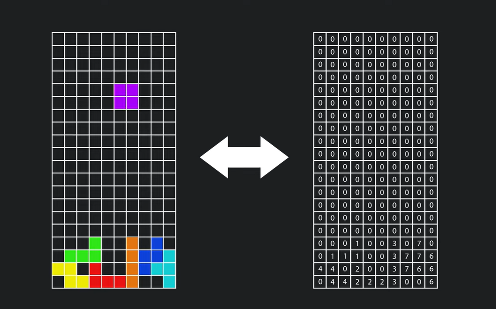

# C++ Tetris Game using raylib

🕹️🎮 This GitHub repository contains Tetris game built with the C++ programming language and the raylib library. 💻🎨🎧 The game uses various raylib functions for graphics, input handling, and audio and can be played on Windows, macOS, and Linux computers. 

# Grid Layouts

  

